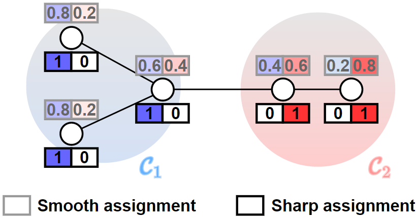
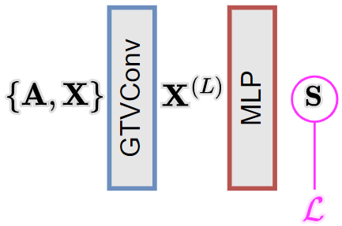
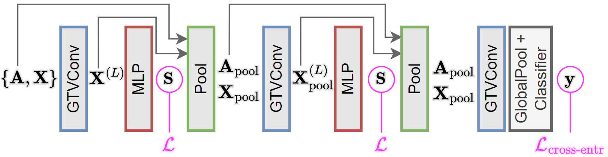

[](https://icml.cc/virtual/2023/poster/24747)
[](https://arxiv.org/abs/2211.06218)
[](https://github.com/FilippoMB/Total-variation-graph-neural-networks/blob/main/tvgnn_poster.pdf)
[](https://youtu.be/Dyb1YJOez8w)

Tensorflow and Pytorch implementation of the Total Variation Graph Neural Network (TVGNN) as presented in the [original paper](https://arxiv.org/abs/2211.06218).

The TVGNN model can be used to **cluster** the vertices of an annotated graph, by accounting both for the graph topology and the vertex features. Compared to other GNNs for clustering, TVGNN creates *sharp* cluster assignments that better approximate the optimal (in the minimum cut sense) partition.



The TVGNN model can also be used to implement [graph pooling](https://gnn-pooling.notion.site/) in a deep GNN architecture for tasks such as graph classification.

# Downstream tasks
TVGNN can be used to perform vertex clustering and graph classification. Other tasks such as graph regression can also be done with the TVGNN model.

### Vertex clustering
This is an unsupervised task, where the goal is to generate a partition of the vertices based on the similarity of their vertex features and the graph topology. The GNN model is trained only by minimizing the unsupervised loss $\mathcal{L}$.



### Graph classification
This is a supervised with goal of predicting the class of each graph. The GNN rchitectures for graph classification alternates GTVConv layers with a graph pooling layer, which gradually distill the global label information from the vertex representations. The GNN is trained by minimizing the unsupervised loss $\mathcal{L}$ for each pooling layer and a supervised cross-entropy loss $\mathcal{L}_\text{cross-entr}$ between the true and predicted class label.



# 💻 Implementation


### Tensorflow
This implementation is based on the [Spektral](https://graphneural.network/) library and follows the [Select-Reduce-Connect](https://graphneural.network/layers/pooling/#srcpool) API.
To execute the code, first install the conda environment from [tf_environment.yml](tensorflow/tf_environment.yml)

    conda env create -f tf_environment.yml

The ``tensorflow/`` folder includes:

- The implementation of the [GTVConv](/tensorflow/GTVConv.py) layer
- The implementation of the [AsymCheegerCutPool](/tensorflow/AsymCheegerCutPool.py) layer
- An example script to perform the [clustering](/tensorflow/clustering.py) task
- An example script to perform the  [classification](/tensorflow/classification.py) task


### Pytorch
This implementation is based on the [Pytorch Geometric](https://pytorch-geometric.readthedocs.io/) library. To execute the code, install the conda environment from [pytorch_environment.yml](pytorch/pytorch_environment.yml)

    conda env create -f pytorch_environment.yml

The ``pytorch/`` folder includes:

- The implementation of the [GTVConv](/pytorch/GTVConv.py) layer
- The implementation of the [AsymCheegerCutPool](/pytorch/AsymCheegerCutPool.py) layer
- An example script to perform the [clustering](/pytorch/clustering.py) task
- An example script to perform the  [classification](/pytorch/classification.py) task


### Spektral

TVGNN is available on Spektral:

- [GTVConv](https://graphneural.network/layers/convolution/#gtvconv) layer,
- [AsymCheegerCutPool](https://graphneural.network/layers/pooling/#asymcheegercutpool) layer,
- [Example script](https://github.com/danielegrattarola/spektral/blob/master/examples/other/node_clustering_tvgnn.py) to perform node clustering with TVGNN.

# 📚 Citation
If you use TVGNN in your research, please consider citing our work as

````bibtex
@inproceedings{hansen2023total,
  title={Total variation graph neural networks},
  author={Hansen, Jonas Berg and Bianchi, Filippo Maria},
  booktitle={International Conference on Machine Learning},
  pages={12445--12468},
  year={2023},
  organization={PMLR}
}
````

# ⚙️ Technical details 
TVGNN consists of the GTVConv layer and the AsymmetricCheegerCut layer.

### GTVConv
The GTVConv layer is a *message-passing* layer that minimizes the $L_1$-norm of the difference between features of adjacent nodes. The $l$-th GTVConv layer updates the node features as

$$\mathbf{X}^{(l+1)}  = \sigma\left[ \left( \mathbf{I} - 2\delta \mathbf{L}_\Gamma^{(l)}  \right) \mathbf{X}^{(l)}\mathbf{\Theta}  \right] $$ 

where $\sigma$ is a non-lineary, $\mathbf{\Theta}$ are the trainable weights of the layer, and $\delta$ is an hyperparameter. $\mathbf{L}^{(l)}_ \Gamma$ is a Laplacian defined as $\mathbf{L}^{(l)}_ \Gamma$ = $\mathbf{D}^{(l)}_ \Gamma - \mathbf{\Gamma}^{(l)}$, where $\mathbf{D}_\Gamma = \text{diag}(\mathbf{\Gamma} \boldsymbol{1})$ and 

$$ [\mathbf{\Gamma}]^{(l)}_ {ij} = \frac{a_ {ij}}{\texttt{max}\{ \lVert \boldsymbol{x}_i^{(l)} - \boldsymbol{x}_j^{(l)}  \rVert_1, \epsilon \}}$$

where $a_{ij}$ is the $ij$-th entry of the adjacency matrix, $\boldsymbol{x}_i^{(l)}$ is the feature of vertex $i$ at layer $l$ and $\epsilon$ is a small constant that avoids zero-division.

### AsymCheegerCut
The AsymCheegerCut is a *graph pooling* layer that internally contains an $\texttt{MLP}$ parametrized by $\mathbf{\Theta}_\text{MLP}$ and that computes:
- a cluster assignment matrix $\mathbf{S} = \texttt{Softmax}(\texttt{MLP}(\mathbf{X}; \mathbf{\Theta}_\text{MLP})) \in \mathbb{R}^{N\times K}$, which maps the $N$ vertices in $K$ clusters,
- an unsupervised loss $\mathcal{L} = \alpha_1 \mathcal{L}_ \text{GTV} + \alpha_2 \mathcal{L}_ \text{AN}$, where $\alpha_1$ and $\alpha_2$ are two hyperparameters,
- the adjacency matrix and the vertex features of a coarsened graph

$$\mathbf{A}^\text{pool} = \mathbf{S}^T \tilde{\mathbf{A}} \mathbf{S} \in\mathbb{R}^{K\times K}; \\ \mathbf{X}^\text{pool}=\mathbf{S}^T\mathbf{X} \in\mathbb{R}^{K\times F}.
$$

The term $\mathcal{L}_ \text{GTV}$ in the loss minimizes the graph total variation of the cluster assignments $\mathbf{S}$ and is defined as

$$\mathcal{L}_ \text{GTV} = \frac{\mathcal{L}_ \text{GTV}^*}{2E} \in [0, 1],$$

where $\mathcal{L}_ \text{GTV}^*$ = $\displaystyle\sum_{k=1}^K\sum_{i=1}^N \sum_{j=i}^N a_{i,j} |s_{i,k} - s_{j,k}|$, $s_{i,k}$ is the assignment of vertex $i$ to cluster $k$ and $E$ is the number of edges.

The term $\mathcal{L}_\text{AN}$ encourages the partition to be balanced and is defined as

$$\mathcal{L}_ {\text{AN}} = \frac{\beta - \mathcal{L}^*_ \text{AN}}{\beta} \in [0, 1],$$

where $\mathcal{L}_ \text{AN}^* = \displaystyle\sum^K_{k=1} ||\boldsymbol{s}_ {:,k}$ - $\text{quant}_ \rho (\boldsymbol{s}_ {:,k})||_ {1, \rho}$.
When $\rho = K-1$, then $\beta = N\rho$.
When $\rho$ takes different values, then $\beta = N\rho\min(1, K/(\rho+1))$. 
$\text{quant}_ \rho(\boldsymbol{s}_ k)$ denotes the $\rho$-quantile of $\boldsymbol{s}_ k$ and $||\cdot||_ {1,\rho}$ denotes an asymmetric $\ell_1$ norm, which for a vector $\boldsymbol{x} \in \mathbb{R}^{N\times 1}$ is $||\boldsymbol{x}||_ {1,\rho}$ = $\displaystyle\sum^N_{i=1} |x_{i}|_ \rho$, where $|x_i|_ \rho = \rho x_i$ if $x_i\geq 0$ and $|x_i|_ \rho = -x_i$ if  $x_i < 0$. 
